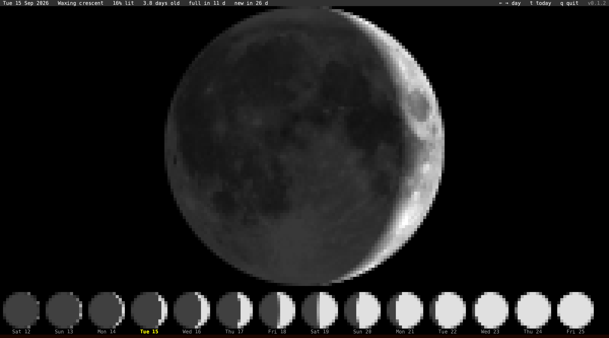

# moon

The Moon as it looks tonight, in the terminal.



The big disk is the near side of the Moon, lit for the phase of the
moment: the sunlit part in light gray and white, the night side in dark
gray, craters and maria on both. A strip of phase symbols along the bottom shows the
three days before, the day on screen, and the days ahead until the edge
of the window. Today's label is yellow.

Part of the [Fe₂O₃ suite](https://isene.github.io/fe2o3/). Built on
[crust](https://github.com/isene/crust) (panes) and
[orbit](https://github.com/isene/orbit) (phase).

## Keys

| Key | Action |
|---|---|
| `←` `→` / `h` `l` | a day back / forward |
| `t` | back to today |
| `q` | quit |

The picture is drawn on start, on a key and on a resize. Nothing runs
in between.

## Install

```bash
git clone https://github.com/isene/moon
cd moon
cargo build --release
```

`crust` and `orbit` are expected as sibling checkouts (`../crust`,
`../orbit`). Release binaries for Linux and macOS are on the
[releases page](https://github.com/isene/moon/releases).

## How it is drawn

Every cell is a `▀` with one gray for its top half and one for its
bottom, so a 50-row window gives a 100-pixel moon. The map is NASA's
LRO camera mosaic of the near side, 512 pixels across, embedded in the
binary. The phase comes from orbit's mean lunar cycle, so it can be a
few hours off the true phase. The Moon's slight wobble (libration) is
not drawn; the map is always the mean near side, north up, with the lit
side on the right while waxing, as seen from the northern hemisphere.

## Credits

Moon map: NASA/GSFC/Arizona State University, Lunar Reconnaissance
Orbiter (LROC WAC), from the
[CGI Moon Kit](https://svs.gsfc.nasa.gov/4720). Public domain.

## License

Public domain (Unlicense).
